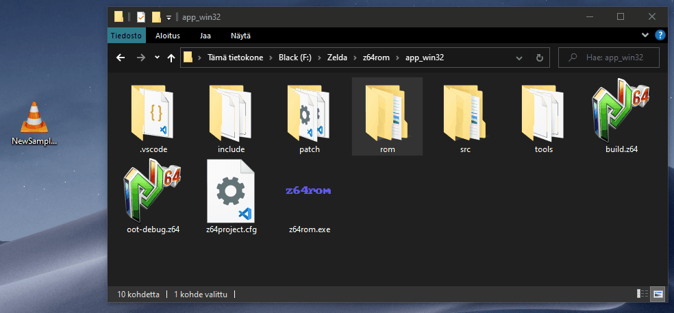

# z64rom

##### For questions and feature requests [join z64tools discord](https://discord.gg/52DgAggYAT)!
##### [Download z64rom here!](https://github.com/z64tools/z64rom/releases)

## Requirements

Before you launch z64rom, copy your rom to same directory so z64rom will detect it on the first time setup. This is not really a **requirement** as you can later **drag and drop** your rom on to **z64rom.exe** in order to dump it.

### Replacing Samples

To replace a sample, copy the sample folder you want to replace from `rom/sound/sample/.vanilla/*` and paste it in `rom/sound/sample/*`. Copy your audio (supported formats: mp3, wav, aiff) into this folder copy and you should be done.

z64rom will convert the newest audio file it finds from this folder so you do not have to clean old samples from this directory. Also naming does not matter as long as it's one of the formats listed above.

### Arguments

| Argument        | Action                                            |
| --------------- | ------------------------------------------------- |
| --i             | Specify input `[.z64]`                            |
| --zmap          | Renames all `.zroom`s to `.zmap`                  |
| --zroom         | Renames all `.zmap`s to `.zroom`                  |
| --B             | Force compile/convert                             |
| --M [option]    | Make only `[sound / code]`                        |
| --info          | Print extra info                                  |
| --compress      | Compress `[not implemented yet]`                  |
| --actor [id]    | Get Actor info, pair with --i                     |
| --dma [id]      | Get Dma info, pair with --i                       |
| --update        | Check for z64hdr update                           |
| --no-make       | Do not compile/convert                            |
| --no-wav        | Do not dump wavs                                  |
| --generic       | Use generic names on dump `Sample_001`            |
| --make-only     | Compile/convert only                              |
| --single-thread | Process only on single thread. Good for debugging |
| --no-wait       | Do not ask to press enter on exit [successful]    |

## Credits

**Documentation:** \
DezZival \
sklitte22

**Testers:** \
Zeldaboy14 \
Nokaubure \
sklitte22

**Special Thanks:** \
Sauraen \
Tharo
